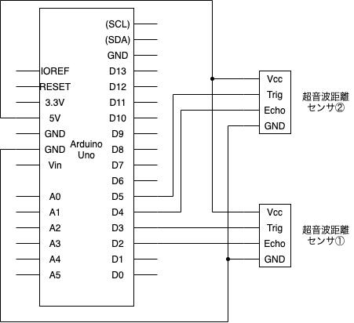
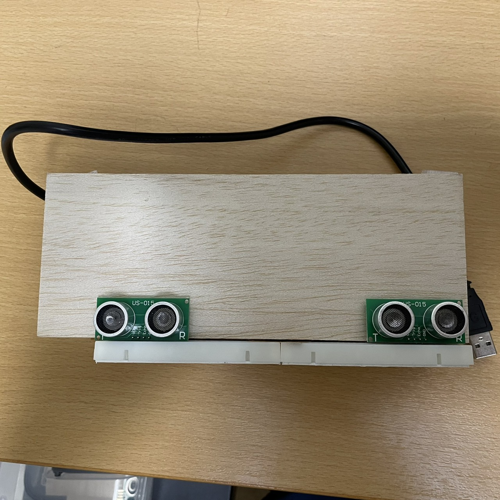
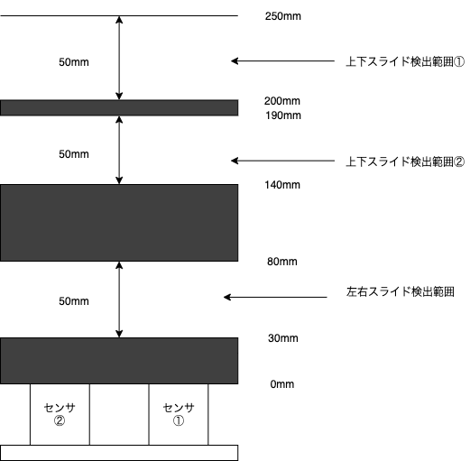
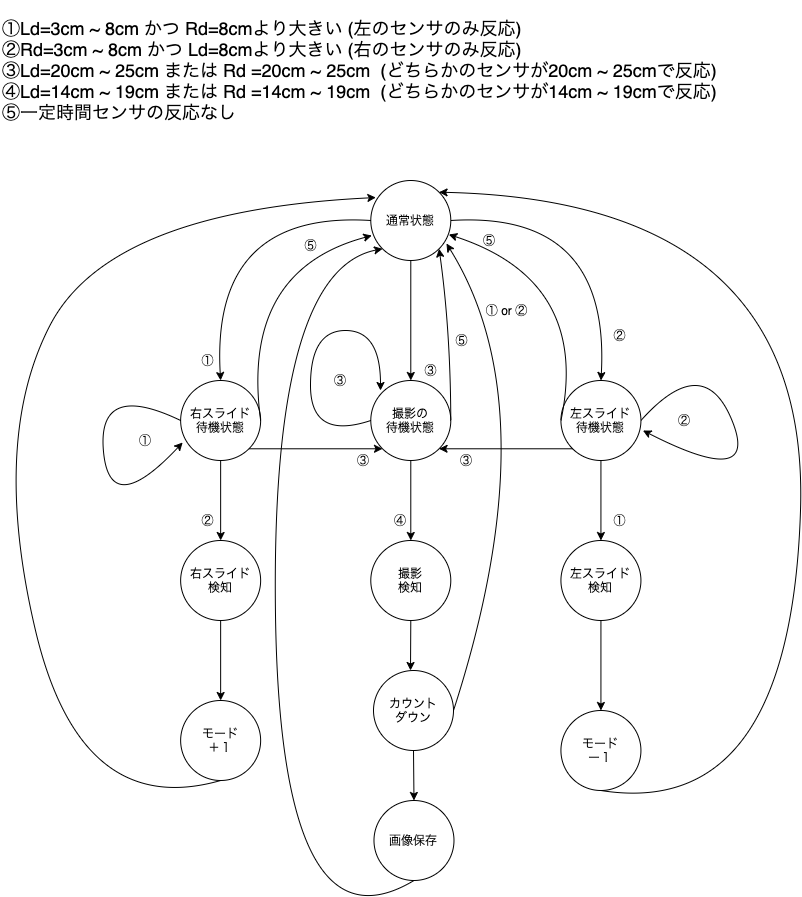
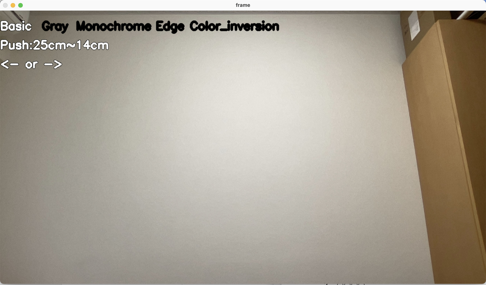
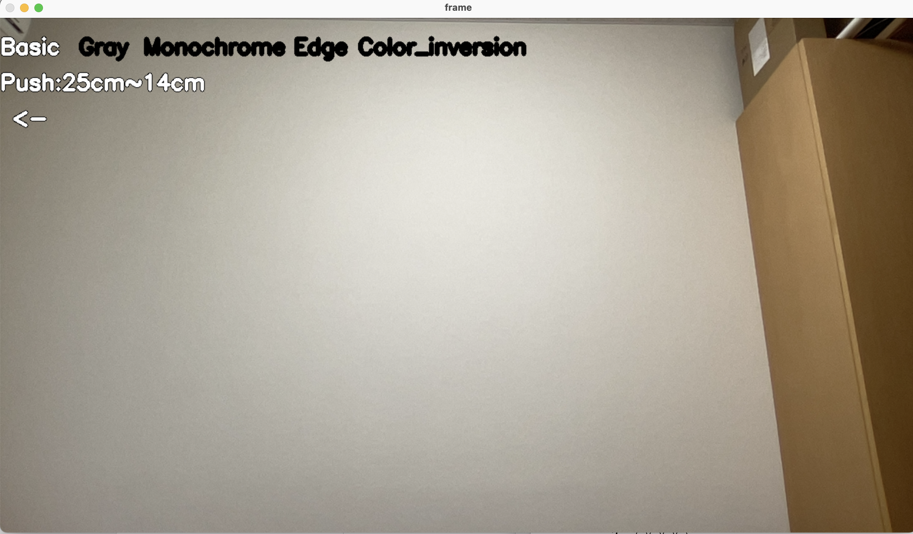
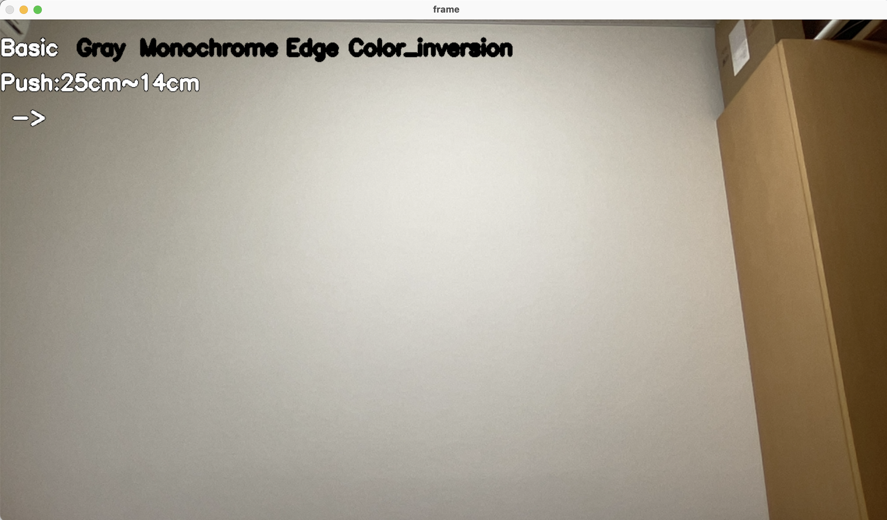
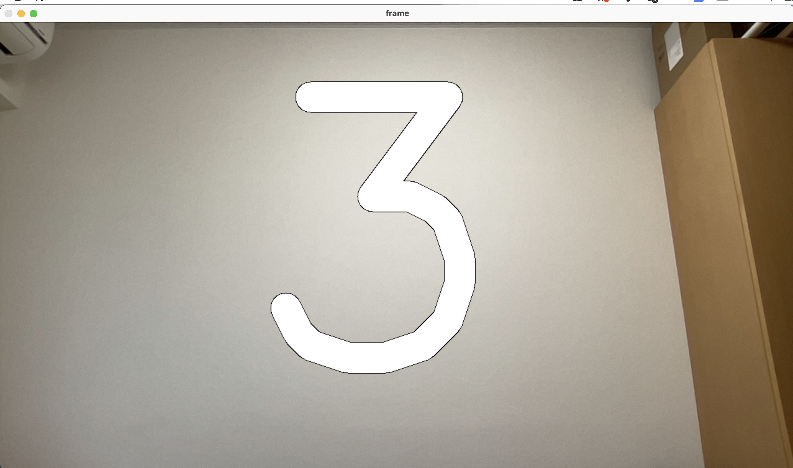
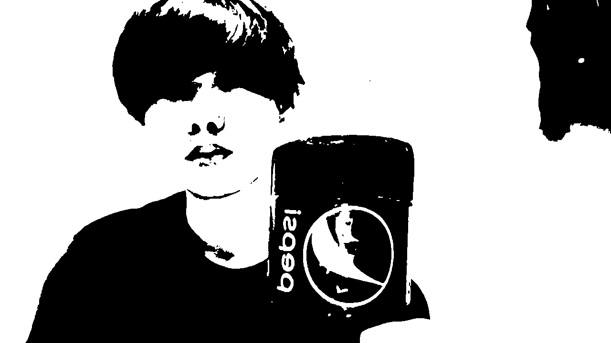
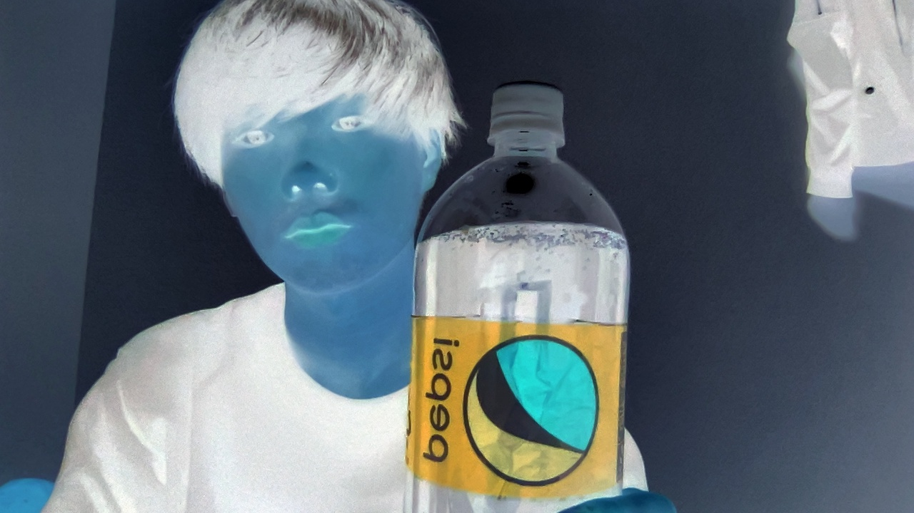

# 名前
Sensor-mode-change-Camera

# 完成動画

[デモ動画はこちら](https://youtu.be/b7HB9DZ3f78) 

# 環境及び機材

OS:macOS 
言語:Python(ver:3.8.10),Arduino IDE 
使用パーツ:超音波距離センサ×2(US-015),ArduinoUNO,ブレッドボード(EIC-801),ジャンプワイヤー×数本

# 回路

# 概要
下の図のように超音波距離センサ2つを使ってジェスチャー(上下左右)を認識し、加工モードを変更できるカメラです。

2つのセンサを使うことにより、以下のように範囲ごとで上下と左右の操作を判定しています。

以下の画像が状態遷移図(UML)です。

# 画面説明
## 左右スライド
①通常状態(<- or ->)

何も操作を行っていない状態。

②左スライド待機状態(<-)

右側の超音波距離センサが反応した状態。

③右スライド待機状態(->)

左側の超音波距離センサが反応した状態。

## 上下スライド
①通常状態(Push:25cm~14cm)

何も操作を行っていない状態。

②上下スライド待機状態(More push!)

20cm~25cmの間でどちらかの超音波距離センサが反応した状態。

③撮影開始状態(3秒間カウントダウン表示)

②のあとに14cm~19cmの間でどちらかの超音波距離センサが反応した状態。

# 加工モード
①basic(無加工)

②gray(グレースケール)

③Monochrome(白黒)

④edge(エッジ検出写真)

③color_inversion(色反転写真)
